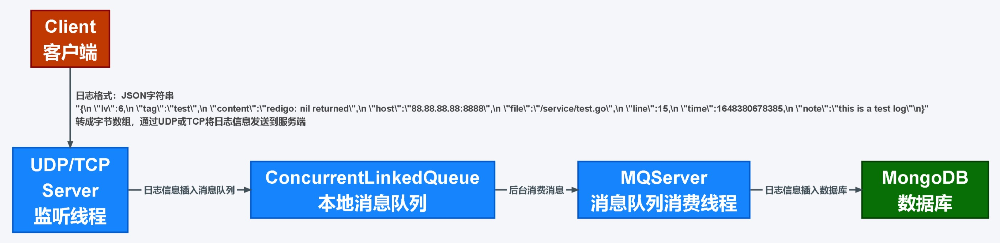
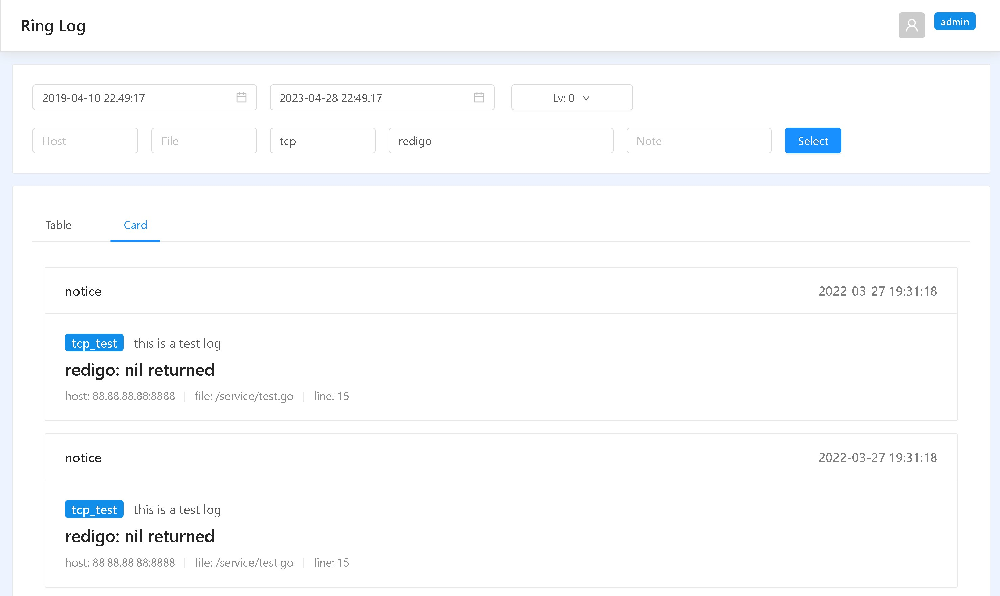

# RingLog
## 基于Spring Boot整合MongoDB、UDP/TCP及本地消息队列实现的日志收集系统。
***

### 实现原理
* 使用MongoDB存储日志数据。
* 使用UDP/TCP接收日志信息。
* 使用ConcurrentLinkedQueue实现消息队列服务，所有日志信息先插入消息队列，再由后台线程异步插入MongoDB数据库。


***

### 启动项目
* 部署MongoDB/MongoDB集群，创建数据库。
* 填写resources/application.properties配置文件，填写Mongodb配置及UDP/TCP监听服务配置。
* 启动项目（应用首次启动将在指定MongoDB数据库下自动创建user_info集合）。
* 启动后访问网页控制台: http://127.0.0.1:9000/#/ 。


***

### 日志收集方式
可使用UDP或TCP监听接收外部日志。
#### UDP/TCP客户端发送日志信息
* 先将日志信息转为如下格式的JSON字符串。
```json
{
  "lv":6,
  "tag":"test",
  "content":"redigo: nil returned",
  "host":"88.88.88.88:8888",
  "file":"/service/test.go",
  "line":15,
  "time":1648380678385,
  "note":"this is a test log"
}
```
```json
"{\n  \"lv\":6,\n  \"tag\":\"test\",\n  \"content\":\"redigo: nil returned\",\n  \"host\":\"88.88.88.88:8888\",\n  \"file\":\"/service/test.go\",\n  \"line\":15,\n  \"time\":1648380678385,\n  \"note\":\"this is a test log\"}"
```
* 再将该JSON字符串转为字节数组，使用UDP/TCP发送到RingLog服务端，服务端UDP监听端口默认为8999，TCP监听端口默认为8998。
#### 客户端代码示例
* Go语言
```
 // 使用UDP发送日志信息
 socket, err := net.DialUDP("udp", nil, &net.UDPAddr{
	IP:   net.IPv4(127, 0, 0, 1),
	Port: 8999,
 })
 socket.Write([]byte("{\n  \"lv\":6,\n  \"tag\":\"udp_test\",\n  \"content\":\"redigo: nil returned\",\n  \"host\":\"88.88.88.88:8888\",\n  \"file\":\"/hello/service/test.go\",\n  \"line\":15,\n  \"time\":1648380678385,\n  \"note\":\"this is a test log\"\n}")
```
#### 日志字段说明
* lv 日志等级
* tag 日志标签
* content 日志内容
* host 日志所属主机名称
* file 产生该日志的文件路径
* line 日志产生于该文件的第几行
* time 日志产生时间
* note 日志备注
#### 日志等级说明
日志等级 lv（int类型）
* 1 Emergency: system is unusable 导致系统不可用的事故
* 2 Alert: action must be taken immediately 必须立即处理的问题
* 3 Critical: critical conditions 需要立即修复的紧急情况
* 4 Error: error conditions 运行时出现的错误，不需要立即进行修复
* 5 Warning: warning conditions 可能影响系统功能，需要提醒的重要事件
* 6 Notice: normal but significant condition 不影响正常功能，但需要注意的消息
* 7 Informational: informational messages 系统正常运行情况下的一般信息
* 8 Debug: debug-level messages 开发时对系统进行诊断的信息
***

### 检索日志方式

#### HTTP接口查询

#### 接口URL
> http://127.0.0.1:9000/log/getLog

#### 请求方式
> POST

#### Content-Type
> form-data

#### 请求Header参数
参数名 | 示例值 | 参数类型 | 是否必填 | 参数描述
--- | --- | --- | --- | ---
user | admin | Text | 是 | user_info集合中的管理员账号
pwd | 123456 | Text | 是 | user_info集合中的管理员密码
#### 请求Body参数
参数名 | 示例值 | 参数类型 | 是否必填 | 参数描述
--- | --- | --- | --- | ---
start | 1648380678385 | Text | 是 | 时间区间（开始）
end | 1648380678386 | Text | 是 | 时间区间（结尾）
lv | 6 | Text | 否 | 日志级别
tag | test | Text | 否 | 日志标签
content | redis | Text | 否 | 日志内容
host | 88.88.88.88:8888 | Text | 否 | 日志所属主机
file | /service/test.go | Text | 否 | 日志所属文件
note | this is a test log | Text | 否 | 日志备注信息
#### 成功响应示例
```json
{
	"code": 200,
	"msg": "success",
	"data": [
		{
			"_id": {
				"time": 1649486669000,
				"date": "2022-04-09T06:44:29.000+00:00",
				"timestamp": 1649486669,
				"new": false,
				"machine": -1478292246,
				"inc": 725857564,
				"timeSecond": 1649486669
			},
			"lv": 6,
			"tag": "test",
			"content": "redigo: nil returned",
			"host": "88.88.88.88:8888",
			"file": "/service/test.go",
			"note": "this is a test log",
			"line": 15,
			"time": 1648380678385
		},
		{
			"_id": {
				"time": 1649486670000,
				"date": "2022-04-09T06:44:30.000+00:00",
				"timestamp": 1649486670,
				"new": false,
				"machine": -1478292246,
				"inc": 725857565,
				"timeSecond": 1649486670
			},
			"lv": 6,
			"tag": "test",
			"content": "redigo: nil returned",
			"host": "88.88.88.88:8888",
			"file": "/service/test.go",
			"note": "this is a test log",
			"line": 15,
			"time": 1648380678385
		}
	]
}
```
#### 失败响应示例
* 管理员用户身份验证失败（user与pwd不匹配）
```json
{
	"code": 440,
	"msg": "authentication error"
}
```
***

### Mongodb数据库
#### log_data集合（日志数据，用于存储所有日志信息）
* 存储文档格式
```json
{
  "_id": {
    "$oid": "62512b4da7e30cea2b43b51c"
  },
  "lv": 6,
  "tag": "test",
  "content": "redigo: nil returned",
  "host": "88.88.88.88:8888",
  "file": "/service/test.go",
  "note": "this is a test log",
  "line": 15,
  "time": {
    "$numberLong": "1648380678385"
  }
}
```
#### user_info集合（管理员用户信息，用于检索日志时鉴权）
* 存储文档格式
```json
{
    "_id": {
        "$oid": "624ebc1f728f90ef47d09f45"
    },
    "user": "admin",
    "pwd": "e10adc3949ba59abbe56e057f20f883e"
}
```
pwd密码用MD5加密。
当user_info不存在或user_info内没有用户信息时，应用会自动创建用户，默认用户名admin，密码123456。

*** 

### 项目结构
* config `配置类`
   * InterceptorConfig.java `拦截器配置`
   * MongodbConfig.java `MongoDB连接配置`
   * TcpConfig.java `TCP监听配置`
   * UdpConfig.java `UDP监听配置`
* controller `控制器层`
   * LogController.java `日志查询接口`
* dao `模板层`
   * LogMsg.java `日志消息模板`
* interceptor `拦截器`
   * ApiInterceptor.java `HTTP接口拦截器`
* server `监听服务层`
   * MQServer.java `本地消息队列消费服务`
   * TcpServer.java `TCP监听消息服务`
   * UdpServer.java `UDP监听消息服务`
* service `HTTP接口服务层`
   * LogService.java `日志查询服务`
* util ``
   * LogUtil.java `日志操作工具`
   * Md5Util.java `MD5密钥生成工具`
   * MongodbUtil.java `MongoDB操作工具`
   * ResultUtil.java `接口返回模板`
* RinglogApplication.java `启动类`