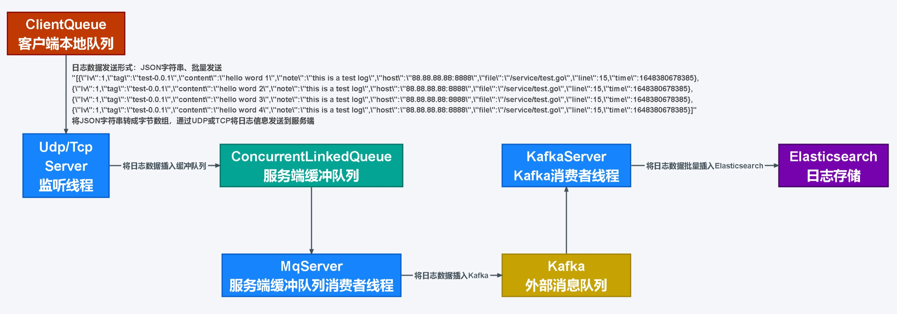
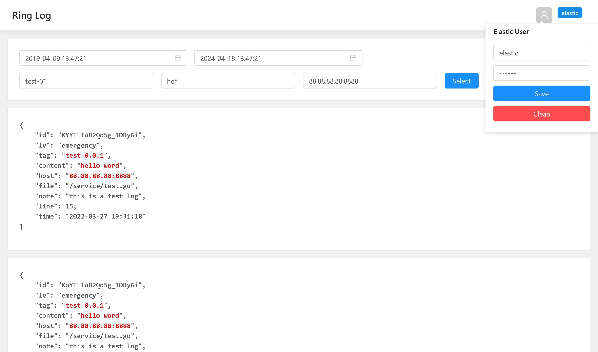
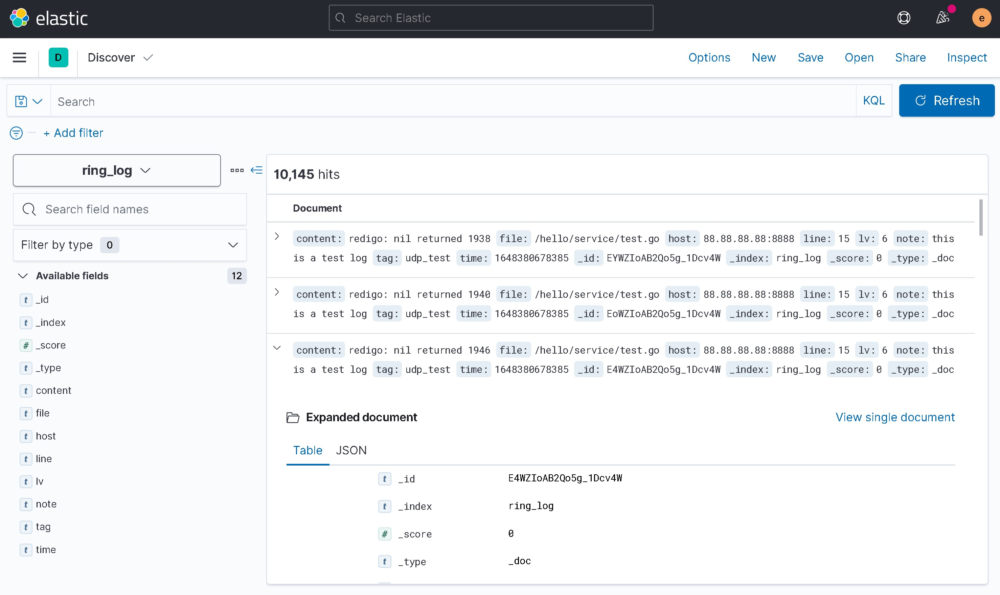

# RingLog
## 基于Spring Boot整合Elasticsearch、Kafka及缓冲队列实现的日志收集系统。


***

### 实现原理
* 使用Elasticsearch存储日志数据。
* 使用UDP/TCP监听接收外来日志数据，客户端将产生的日志数据存入内存中，定期将一定数量的日志数据（可以是单条日志，也可以是多条日志列表）转为JSON字符串格式发送到RingLog服务端。
* 使用ConcurrentLinkedQueue实现服务端缓冲队列，所有外来日志数据先插入缓冲队列，再由后台线程（一个或者多个消费者线程）将日志数据异步发送至外部消息队列Kafka。
* Kafka中的一条消息中可以包含一个或者多个日志信息（JSON字符串形式存储），由Kafka消费者将日志数据批量插入Elasticsearch。


***

### 启动项目
* 部署Elasticsearch/Elasticsearch集群，创建索引：ring_log。
* 部署Kafka/Kafka集群，创建Topic：ring_log。
* 填写resources/application.properties配置文件，填写Elasticsearch配置、Kafka配置、UDP/TCP监听服务配置。
* 启动项目，访问控制台 http://127.0.0.1:9000/#/ ，控制台自带三条件通配符检索功能，条件value为空则不启用该条件检索，即最多只能设置三个检索条件，控制台登录账号密码为项目连接elasticsearch的账号密码。



（通配符规则：'hi*'：tag、content、note、host、file这些字段中有以'hi'为前缀的值，'*hi*'：tag、content、note、host、file这些字段的值中包含'hi'）

* 或使用Kibana连接Elasticsearch并检索日志。


***

### 日志收集方式
可使用UDP或TCP监听接收外部日志。
#### UDP/TCP客户端发送日志信息
先将日志信息转为JSON字符串。
* 客户端将多条日志信息合并发送
```json
[
  {
    "lv":6,
    "tag":"test-0.0.1",
    "content":"redigo: nil returned",
    "note":"this is a test log",
    "host":"88.88.88.88:8888",
    "file":"/service/test.go",
    "line":15,
    "time":1648380678385
  },
  {
    "lv":6,
    "tag":"test-0.0.1",
    "content":"redigo: nil returned",
    "note":"this is a test log",
    "host":"88.88.88.88:8888",
    "file":"/service/test.go",
    "line":15,
    "time":1648380678385
  }
]
```
```json
"[{\"lv\":1,\"tag\":\"test-0.0.1\",\"content\":\"hello word\",\"note\":\"this is a test log\",\"host\":\"88.88.88.88:8888\",\"file\":\"/service/test.go\",\"line\":15,\"time\":1648380678385},{\"lv\":1,\"tag\":\"test-0.0.1\",\"content\":\"hello word\",\"note\":\"this is a test log\",\"host\":\"88.88.88.88:8888\",\"file\":\"/service/test.go\",\"line\":15,\"time\":1648380678385}]"
```

* 客户端直接发送单条日志信息
```json
[
  {
    "lv":6,
    "tag":"test-0.0.1",
    "content":"redigo: nil returned",
    "note":"this is a test log",
    "host":"88.88.88.88:8888",
    "file":"/service/test.go",
    "line":15,
    "time":1648380678385
  }
]
```
```json
"[{\"lv\":1,\"tag\":\"test-0.0.1\",\"content\":\"hello word\",\"note\":\"this is a test log\",\"host\":\"88.88.88.88:8888\",\"file\":\"/service/test.go\",\"line\":15,\"time\":1648380678385}]"
```
* 再将该JSON字符串转为字节数组，使用UDP/TCP发送到RingLog服务端，服务端UDP监听端口默认为8999，TCP监听端口默认为8998。

#### 日志字段说明
* lv 日志等级（整数表示，范围：1~8）
* tag 日志标签（可以是所属项目名+项目版本号）
* content 日志内容
* note 日志备注（可以是对该日志的简短描述，或是额外的标注补充）
* host 日志所属的主机（可以是主机名称或主机地址+应用程序端口号）
* file 产生该日志的文件路径
* line 日志产生于该文件的第几行（int类型）
* time 日志产生时间（毫秒级时间戳，13位，long整数）

#### 日志等级说明
日志等级 lv（int类型）
* 1 Emergency: system is unusable 导致系统不可用的事故
* 2 Alert: action must be taken immediately 必须立即处理的问题
* 3 Critical: critical conditions 需要立即修复的紧急情况
* 4 Error: error conditions 运行时出现的错误，不需要立即进行修复
* 5 Warning: warning conditions 可能影响系统功能，需要提醒的重要事件
* 6 Notice: normal but significant condition 不影响正常功能，但需要注意的消息
* 7 Informational: informational messages 系统正常运行情况下的一般信息
* 8 Debug: debug-level messages 开发时对系统进行诊断的信息

#### 客户端代码示例
* Go语言，UDP发送日志
```
//日志信息结构体
type Log struct {
	Lv int `json:"lv"`
	Tag string `json:"tag"`
	Content string `json:"content"`
	Note string `json:"note"`
	Host string `json:"host"`
	File string `json:"file"`
	Line int `json:"line"`
	Time int64 `json:"time"`
}

//单条日志信息
log := Log{
	Lv: 1,
	Tag: "test-0.0.1",
	Content: "hello word",
	Note: "this is a test log",
	Host: "88.88.88.88:8888",
	File: "/service/test.go",
	Line: 15,
	Time: 1648380678385,
}

//日志信息列表
var logList []Log

//将多条日志信息插入日志信息列表
for i:=0;i<10;i++ {
	logList = append(logList, log)
}

//将日志信息列表转为字节数组[]byte
logListBytes, _ := json.Marshal(logList)
	
//配置UDP连接信息
socket, _ := net.DialUDP("udp", nil, &net.UDPAddr{
	IP:   net.IPv4(127, 0, 0, 1),   //RingLog服务端地址
	Port: 8999,                     //RingLog服务端口
})

//发送日志数据
_, _ = socket.Write(logListBytes)

//关闭socket
_ = socket.Close()
```

***

### Elasticsearch数据存储
#### ring_log索引（用于存储所有日志信息）
* 存储文档格式
```json
{
  "_index": "ring_log",
  "_type": "_doc",
  "_id": "X4UUIoAB2Qo5g_1D2_nM",
  "_version": 1,
  "_score": 0,
  "fields": {
    "note": [
      "this is a test log"
    ],
    "file": [
      "/service/test.go"
    ],
    "line": [
      "15"
    ],
    "host": [
      "88.88.88.88:8888"
    ],
    "lv": [
      "6"
    ],
    "time": [
      "1648380678385"
    ],
    "tag": [
      "test-0.0.1"
    ],
    "_class": [
      "com.dpwgc.ringlog.dao.LogMsg"
    ],
    "_class.keyword": [
      "com.dpwgc.ringlog.dao.LogMsg"
    ],
    "content": [
      "redigo: nil returned"
    ]
  }
}
```

*** 

### 项目结构
* config `配置类`
   * EsConfig.java `Elasticsearch连接配置`
   * TcpConfig.java `TCP监听配置`
   * UdpConfig.java `UDP监听配置`
* controller `控制器层`
   * HelloController.java `web访问接口`
* dao `模板层`
   * LogMsg.java `日志消息模板`
* interceptor `拦截器`
   * ApiInterceptor.java `HTTP接口拦截器`
* mapper `接口层`
   * EsMapper.java `Elasticsearch操作接口`
* server `监听服务层`
   * KafkaServer.java `Kafka消息队列消费者服务`
   * MqServer.java `本地缓冲队列消费者服务`
   * TcpServer.java `TCP监听消息服务`
   * UdpServer.java `UDP监听消息服务`
* util ``
   * LogUtil.java `日志操作工具`
   * EsUtil.java `Elasticsearch操作工具`
* RinglogApplication.java `启动类`